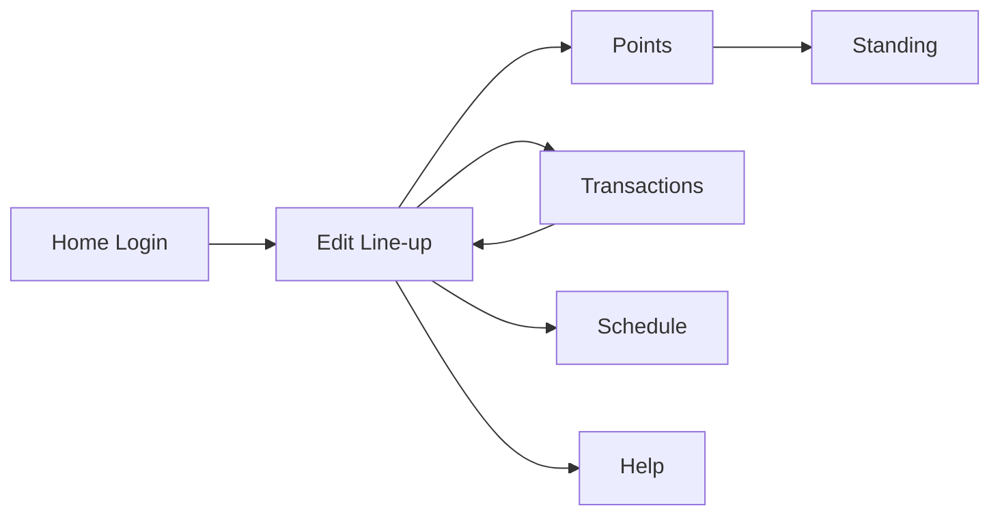

# NBA Playoff Fantasy PRD

## Version
| Field | Value |
|---|---|
| Document Version | v0.2 |
| Date | 2026-04-10 |
| Status | Review-ready |

## 1. Overview
### 1.1 Background
Current fantasy gameplay ends with regular season. Users want a playoff mode to keep competing with friends.

### 1.2 Product Summary
Users set a 10-player squad before playoff rounds, manage transfers across play-in / round windows, earn points from real player performances, and compete in league rankings. MVP uses the NBA Fantasy bootstrap API as the initial player database source.

### 1.3 Goals
- Business goal: retain engagement during playoff period.
- User goal: continue friend-league competition after regular season.
- MVP goal: deliver a playable end-to-end prototype with core pages and APIs.

### 1.4 Target Users
- NBA fans familiar with fantasy basics.
- Social competitive players in private leagues.

### 1.5 Terms
- Round Day: the playable daily checkpoint inside a playoff round, for example `Round 1 Day 2`.
- Play-In: testing-only daily checkpoint before Round 1, for example `Play-In 2`.
- Free Transfer: transfer quota with no penalty inside the current transfer window.
- Captain: selected player with 1.5x multiplier.

## 2. Scope
### 2.1 MVP Pages
- Home
- Edit line-up
- Points
- Transactions
- Standing
- Schedule
- Help

### 2.2 Core Flow

### 2.3 Global Rules (MVP)
- Roster size fixed to 10 players.
- Initial roster must contain exactly 5 Back Court (`BC`) and 5 Front Court (`FC`) players.
- Initial roster budget defaults to 100.
- New accounts start with an empty roster and must create a team before editing lineup, viewing points, or making transfers.
- 5 starters count toward daily score.
- Captain receives 1.5x score multiplier.
- Each round currently has 3 free transfers shared across the whole round. [Configurable]
- Play-In testing windows currently have 3 free transfers per play-in day. [Testing-only]
- `Round 1 Day 1` is the official game start. Before its deadline, transfers are unlimited.
- Each playable day has a deadline 30 minutes before the first game of that day.
- After a day deadline passes, points represent that day and edit/transactions move to the next editable day.

## 3. Functional Requirements
### 3.1 Home
- Register with account, game ID, password, and confirm password.
- Login with account and password.
- Return token and user profile.
- Show error when required fields are missing, passwords do not match, account exists, or game ID exists.

### 3.2 Edit line-up
- If user has no roster, show the initial team builder.
- Initial team builder shows selected squad on the left and player selection on the right.
- Player selection supports search, position filter, team filter, max cost filter, and sorting.
- Create Team validates 10 unique players, 5 `BC`, 5 `FC`, and total salary <= 100.
- Show current editable round/day label and deadline.
- Show starters and bench cards.
- Show `Next` opponent based on the current editable day; if the player has no game that day, show `-`.
- Allow captain selection.
- Save lineup.

### 3.3 Points
- Before `Round 1 Day 1` deadline, keep points locked for production launch.
- If user has no roster, ask user to create the initial team first.
- Show average/final/top game-day points.
- Show player point cards for starters and bench.
- Allow league users to open another manager's current points view from the league table and see the same day snapshot structure.

### 3.4 Transactions
- If user has no roster, ask user to create the initial team first.
- Before `Round 1 Day 1` deadline, show limitless transfer mode.
- During play-in testing, enforce 3 free transfers per play-in day.
- After launch, enforce 3 free transfers per round by default.
- Show free transfers left and finance metrics.
- Select outgoing and incoming players.
- Confirm transfer and refresh lineup/market.
- Show transfer history.

### 3.5 Standing
- Show one global standings table for all registered players.
- Support phase filtering for `Overall`, `Play-In 1`, `Play-In 2`, `Play-In 3`, and `Round 1-4`.
- Rank players by the selected phase points while still showing cumulative `TOT`.
- `TOT` is the cumulative sum of stored playable-period points.
- The player column only needs one clickable player link, which opens that player's current points page.

### 3.6 Schedule
- Show only `Round 1` schedule for now.
- Group games by `Round 1 Day 1`, `Round 1 Day 2`, and so on.
- Keep play-in schedule data available in backend for testing, but do not surface it in the main schedule page.
- Show next relevant deadline and tipoff times.

### 3.7 Help
- Show roster rules.
- Show scoring table.
- Show weekly gameplay guide.

## 4. Non-functional Requirements
### 4.1 Performance
- First meaningful view under 3 seconds in local environment. [To confirm]
- API P95 under 500ms for MVP mock.

### 4.2 Security
- Token should not be exposed in URLs.
- Add authentication middleware in production phase. [To confirm]

### 4.3 Observability
- Log key events: login, lineup save, transfer submit.
- Capture API-level error logs.

### 4.4 Integration
- MVP stores accounts, rosters, teams, players, and game rules in SQLite.
- Player data is imported from `https://nbafantasy.nba.com/api/bootstrap-static/`.
- Future work should add live playoff schedule and box-score scoring integration. [To confirm]

## 5. Data Dictionary
### 5.1 Player
| Field | Type | Required | Description |
|---|---|---|---|
| id | string | Yes | Player ID |
| name | string | Yes | Player name |
| team | string | Yes | Team code |
| position | string | Yes | BC/FC |
| salary | number | Yes | Salary value |
| points | number | No | Daily fantasy points |
| canSelect | boolean | No | Whether player can be selected |
| canTransact | boolean | No | Whether player can be transferred |

### 5.2 User State
| Field | Type | Required | Description |
|---|---|---|---|
| userId | number | Yes | Account owner |
| starters | Player[] | Yes | Starting 5 |
| bench | Player[] | Yes | Bench 5 |
| captainId | string | No | Captain player ID |
| rosterValue | number | Yes | Sum of roster salary |
| bank | number | Yes | Budget remaining |
| usedThisWeek | number | Yes | Transfers used in the current transfer window |

### 5.3 Transaction
| Field | Type | Required | Description |
|---|---|---|---|
| outPlayerId | string | Yes | Outgoing player ID |
| inPlayerId | string | Yes | Incoming player ID |
| timestamp | ISO string | No | Transaction timestamp |

### 5.4 Game Rules
| Field | Type | Required | Description |
|---|---|---|---|
| initial_budget | number | Yes | Default 100 |
| weekly_free_transfers | number | Yes | Legacy default transfer value; current runtime window logic is schedule-driven |
| first_deadline | ISO string | Yes | Legacy fallback for `Round 1 Day 1` launch lock |

## 6. Acceptance Criteria
- Login endpoint returns token.
- New account starts with empty roster.
- Initial team builder can create a legal 10-player roster.
- Illegal initial teams are rejected when over budget or not 5 `BC` + 5 `FC`.
- Edit line-up can save captain choice.
- Points are locked before `Round 1 Day 1` deadline.
- Points page renders summary and player cards.
- Transactions are limitless before `Round 1 Day 1` deadline.
- Play-in testing windows and round windows apply the configured free-transfer rules.
- Transactions can complete at least one transfer and show history.
- Standing/Schedule/Help pages render expected sections.
- Frontend `npx tsc --noEmit` passes.
- Frontend `npm run build` passes.

## 7. Open Questions
1. Should the default free transfer quota stay at 3 per round after testing ends?
2. Should over-limit transfers apply score penalty (for example -4)?
3. Should bench auto-substitute before tipoff lock?
4. Is league admin flow required in MVP?
5. Which live box-score source is preferred for production scoring?
6. Should `Round 1 Day 1` launch lock be set manually by league admin or inferred from schedule import?
