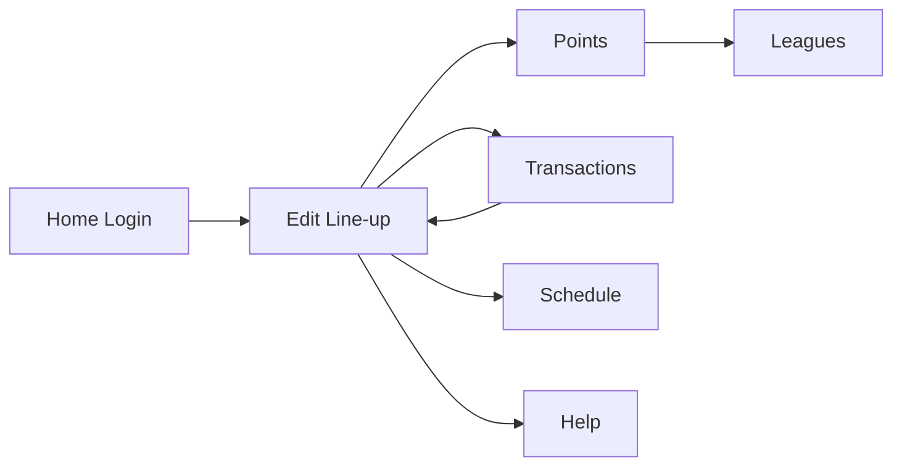

# NBA Playoff Fantasy PRD

## Version
| Field | Value |
|---|---|
| Document Version | v0.1 |
| Date | 2026-04-09 |
| Status | Review-ready |

## 1. Overview
### 1.1 Background
Current fantasy gameplay ends with regular season. Users want a playoff mode to keep competing with friends.

### 1.2 Product Summary
Users set a 10-player squad before playoff rounds, get weekly free transfers, earn points from real player performances, and compete in league rankings.

### 1.3 Goals
- Business goal: retain engagement during playoff period.
- User goal: continue friend-league competition after regular season.
- MVP goal: deliver a playable end-to-end prototype with core pages and APIs.

### 1.4 Target Users
- NBA fans familiar with fantasy basics.
- Social competitive players in private leagues.

### 1.5 Terms
- Gameweek: playoff weekly cycle.
- Free Transfer: weekly transfer quota with no penalty.
- Captain: selected player with 1.5x multiplier.

## 2. Scope
### 2.1 MVP Pages
- Home
- Edit line-up
- Points
- Transactions
- Leagues
- Schedule
- Help

### 2.2 Core Flow

### 2.3 Global Rules (MVP)
- Roster size fixed to 10 players.
- 5 starters count toward daily score.
- Captain receives 1.5x score multiplier.
- Weekly free transfer quota defaults to 2. [Assumption]

## 3. Functional Requirements
### 3.1 Home
- Login with email/password.
- Return token and user profile (mock in MVP).
- Show error when required fields are missing.

### 3.2 Edit line-up
- Show gameweek and deadline.
- Show starters and bench cards.
- Allow captain selection.
- Save lineup.

### 3.3 Points
- Show average/final/top game-day points.
- Show player point cards for starters and bench.

### 3.4 Transactions
- Show free transfers left and finance metrics.
- Select outgoing and incoming players.
- Confirm transfer and refresh lineup/market.
- Show transfer history.

### 3.5 Leagues
- Show private/public/global league tables.
- Show current rank, previous rank, and rank delta.

### 3.6 Schedule
- Show games grouped by date.
- Show gameweek header and tipoff times.

### 3.7 Help
- Show roster rules.
- Show scoring table.
- Show weekly gameplay guide.

## 4. Non-functional Requirements
### 4.1 Performance
- First meaningful view under 3 seconds in local environment. [To confirm]
- API P95 under 500ms for MVP mock.

### 4.2 Security
- Token should not be exposed in URLs.
- Add authentication middleware in production phase. [To confirm]

### 4.3 Observability
- Log key events: login, lineup save, transfer submit.
- Capture API-level error logs.

### 4.4 Integration
- MVP uses in-memory state.
- Future integration with real NBA data APIs. [To confirm]

## 5. Data Dictionary
### 5.1 Player
| Field | Type | Required | Description |
|---|---|---|---|
| id | string | Yes | Player ID |
| name | string | Yes | Player name |
| team | string | Yes | Team code |
| position | string | Yes | G/F/C |
| salary | number | Yes | Salary value |
| points | number | No | Daily fantasy points |

### 5.2 Transaction
| Field | Type | Required | Description |
|---|---|---|---|
| outPlayerId | string | Yes | Outgoing player ID |
| inPlayerId | string | Yes | Incoming player ID |
| timestamp | ISO string | No | Transaction timestamp |

## 6. Acceptance Criteria
- Login endpoint returns token.
- Edit line-up can save captain choice.
- Points page renders summary and player cards.
- Transactions can complete at least one transfer and show history.
- Leagues/Schedule/Help pages render expected sections.
- Frontend `npx tsc --noEmit` passes.
- Frontend `npm run build` passes.

## 7. Open Questions
1. Should free transfer quota always be 2 per week?
2. Should over-limit transfers apply score penalty (for example -4)?
3. Should bench auto-substitute before tipoff lock?
4. Is league admin flow required in MVP?
5. Which real data source is preferred for production?
